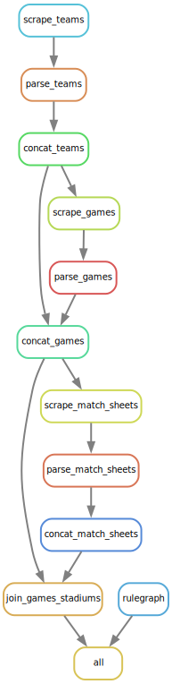

# scrape_transfermarkt

Scrape Transfermarkt for stadium attendances at all Premier League games.

## Scraping

To scrape all seasons:

```{}
bash scrape.sh 7 > data/logs/scrape.log 2>&1 &
```

*Specify the number of cores, redirect output to data/logs/scrape.log, run in the background.*

Alternatively, run each rule with the prefix `concat_` sequentially.

## Tests

Download test data with:

```{}
snakemake -j1 update_test_data
```

Run unit tests with:

```{}
python -m pytest tests/unit
```

## Workflow Diagram

